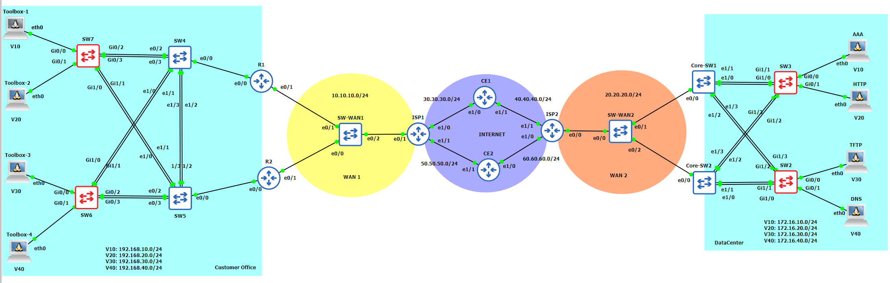

# CCNA M2 – Enterprise LAN/WAN Network Design

This repository contains the complete implementation of a CCNA Module 2
enterprise network topology, built and tested in GNS3.

## Network Topology

## Project Structure

- **CustomerOffice/** – configurations for Customer Office switches and routers  
- **DataCenter/** – configurations for Data Center devices  
- **Internet/** – ISP1, ISP2, CE1, CE2 configurations  
- **WAN1/** – WAN1 related devices  
- **WAN2/** – WAN2 related devices  

## Technologies Used

- VLANs and Inter-VLAN Routing  
- HSRP (LAN and WAN redundancy)  
- EtherChannel (PAgP & LACP)  
- Rapid PVST+  
- RIP v2  
- Static Routing  
- DHCP, DHCP Snooping  
- Dynamic ARP Inspection  
- Port Security  
- AAA with TACACS+  
- SSH remote management  

## Notes

This project was created for academic purposes as part of the CCNA curriculum.
